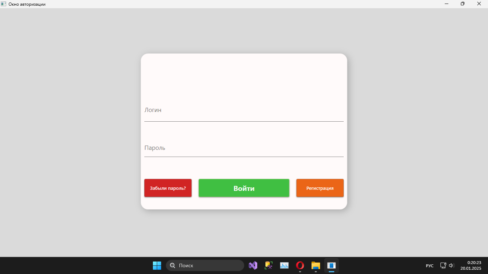

<h1 style="text-align:center;">TaskManager</h1>
<h2 style="text-align:center;">Менеджер задач</h2>

<h3>Описание:</h3>

Данный проект представляет собой десктопное приложение, предназначенное для организации и управления личными и командными задачами.

В приложении присутствует две роли:

<ul>
  <li>Администратор</li>
  <li>Пользователь</li>
</ul>

В возможности пользователя входят такие функции как:

<ul>
  <li>Аутентификация и авторизация</li>
  <li>Управление задачами</li>
  <li>Управление проектами</li>
  <li>Управление командами</li>
  <li>Изменять свои пароль</li>
</ul>

В возможности администратора входят такие функции как:

<ul>
  <li>Все функции пользователя</li>
  <li>Изменять роли пользователем</li>
</ul>

<h3>В ходе создания проекта применялись такие технологии как:</h3>
<ul>
  <li>Язык программирования C#</li>
  <li>Среда разработки Visual Studio</li>
  <li>СУБД SQL Server Management Studio (SSMS)</li>
  <li>Cистема Windows Presentation Foundation (WPF) для построения клиентских приложений</li>
  <li>Язык разметки XAML</li>
</ul>

<h3>Скриншоты проекта:</h3>
<figure>
	
	
Рисунок 1 - окно авторизации

</figure>
<figure>
	
	
Рисунок 2 - окно регистрации

</figure>
<figure>
	
	
Рисунок 3 - окно изменения пароля

</figure>
<figure>
	
	
Рисунок 4 - главное меню

</figure>
<figure>
	
	
Рисунок 5 - личный кабинет

</figure>
<figure>
	
	
Рисунок 6 - окно управления задачами

</figure>
<figure>
	
	
Рисунок 7 - окно управления проектами

</figure>
<figure>
	
	
Рисунок 8 - окно управления командами

</figure>
<figure>
	
	
Рисунок 9 - окно администратора

</figure>

<h3>Видео демонстрация:</h3>

https://github.com/user-attachments/assets/4429b1f5-c352-4b35-88a1-514ebef5e2d3

